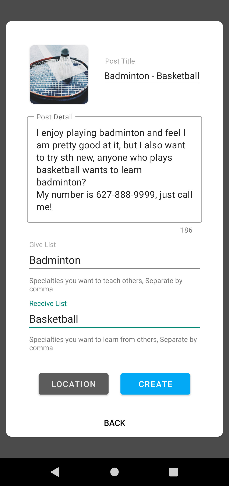

# Give-Receive 易艺

# Project Description:

The project is a social media platform that allows people to share their hobbies, tutor each other to exchange their skills and make friends.
People always wants to learn something new, especially for those who are young. But nowadays the only way to learn new skills is through expensive tuition classes or private lessons.
Give-Receive intends to be a platform for those who are willing to learn and share to meet and learn from each other. They can check the post sent by people nearby, make new friends and 
begin learning with no cost. Lets conclude in an old saying: The gift of a rose leaves a lasting impression.

---

## Developing features:

-   A chatting system allow users to send text message to others and communicate more easily.
-   Multiple language support

## Prototypes 🎨

